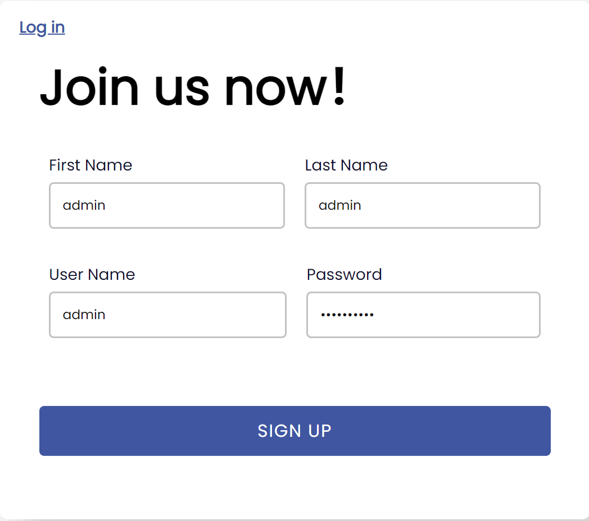
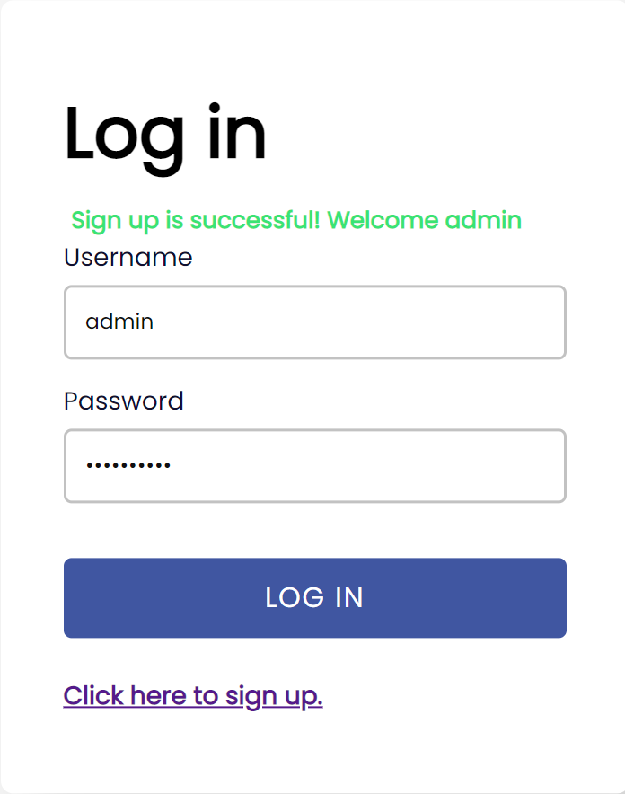
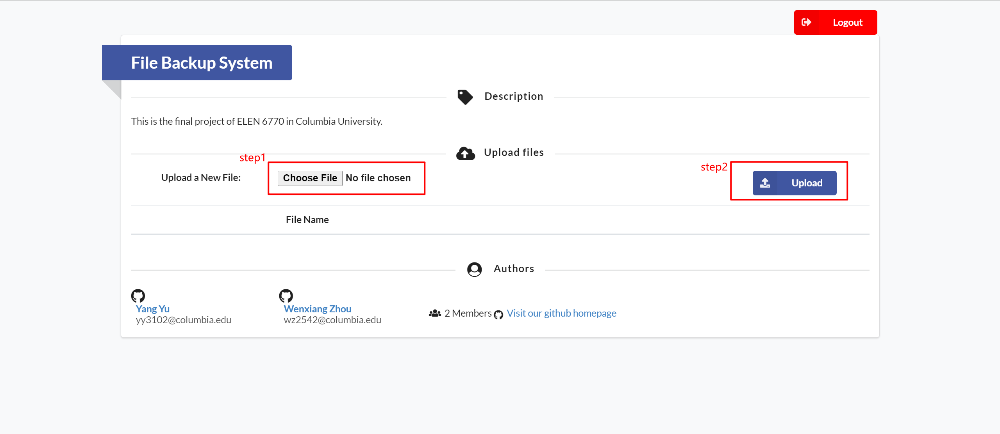
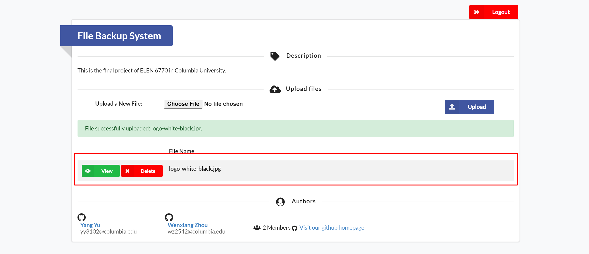

## OVERVIEW

This is a final project of ELEN 6770 in CU.

Develop a cloud-based file back-up application with Java and AWS to minimize CAPEX.

Project website is now deployed on Amazon EC2. You can simply visit our website by 2 ways:

http://18.118.99.89:8080

http://ec2-18-118-99-89.us-east-2.compute.amazonaws.com:8080

## FUNCTION

1. Users should register an account and log in to have access to our file back-up service.
2. Users could upload their own files to the cloud.
3. Users could view and delete the files on the cloud whenever they need.

## USER GUIDE

##### 1. Visit our website

Visit our Homepage: [Homepage](http://18.118.99.89:8080)

##### 2. Sign up and log in

If it is the first time you visit our website, click on the "Click here to sign up" at the bottom of the login page for a quick sign up. If not, directly input your username and password to log in to our system.

Input your basic information and click on the "SIGNUP" button, then you have successfully registered a new account.

After you successfully sign up, you will be redirected to the original login page. Input you username and password, and enjoy our website!

##### 3. Upload a file

Click on the "Choose file" and choose a local file in your device. Then click on the "Upload" button on the  right side. 

If uploaded successfully, the file will be listed in the information table below.

##### 4.Manage your files

You can manage all your files in the file management panel.
Click on the "View" button, you can download the file from the cloud.
Click on the "delete" button, you can delete the file in the cloud.

## SPECIFICATION

1. Utilized Spring Boot, Spring MVC and Thymeleaf to build a Java-based web application.
2. Employed MySQL Server as an external database, and implemented website security with Spring Security.
3. Implemented a series of automated user tests with JUnit and Selenium.
4. Deployed the website on Amazon EC2 and exploited Amazon S3 to make source code back-up.
